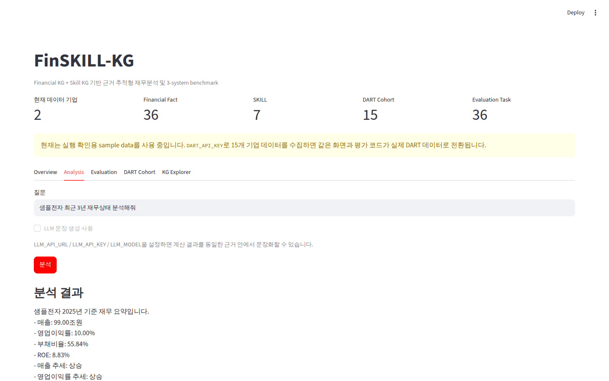
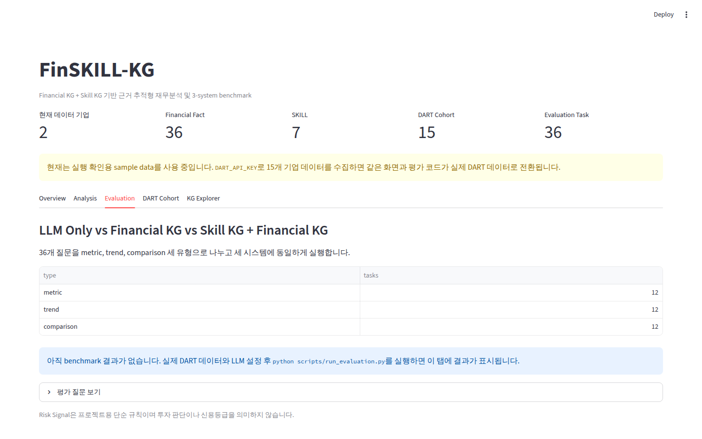
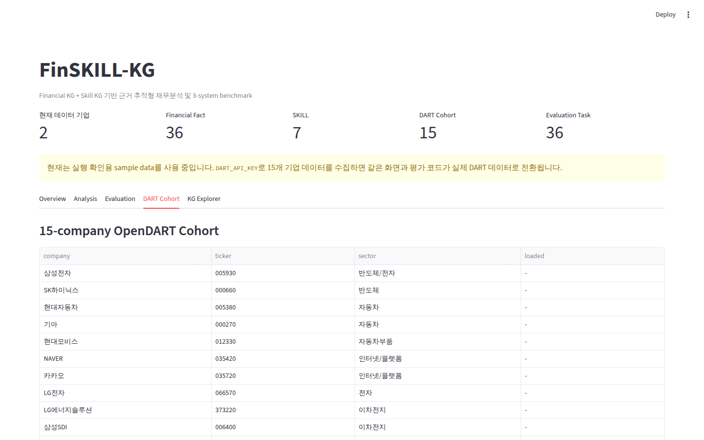

# FinSKILL-KG

금융 데이터를 저장하는 **Financial Knowledge Graph**와 LLM이 어떤 업무를 어떤 순서로 수행해야 하는지 관리하는 **Skill Knowledge Graph**를 함께 구성하고, 재사용 가능한 `SKILL.md`를 이용해 기업 재무분석을 수행하는 프로젝트입니다.

이번 버전은 제안서의 실험 구조와 구현물을 맞추는 데 초점을 맞췄습니다.

- 실제 OpenDART 대상 기업 15개를 cohort로 고정
- 2023~2025년 사업보고서 기준 Financial Fact 수집
- Financial KG와 Skill KG를 연결
- 36개 평가 질문 구성
- `LLM Only`
- `LLM + Financial KG`
- `LLM + Skill KG + Financial KG`
- 세 시스템을 동일 질문과 동일 모델 설정으로 비교
- numerical accuracy, evidence F1, skill accuracy, unsupported rate, latency 측정

> `DART_API_KEY`와 LLM API key는 repository에 저장하지 않습니다.  
> 실제 재무 snapshot은 `scripts/fetch_dart_data.py` 또는 `refresh-dart` workflow로 생성합니다.

## Demo

아래 GIF와 이미지는 현재 repository의 Streamlit 구현물을 직접 실행해 캡처한 결과입니다. 별도 금융 API credential 없이 재현할 수 있도록 화면 캡처는 synthetic sample data를 사용하고, 실제 실험은 동일 코드에 OpenDART snapshot을 연결합니다.


[원본 데모 영상 보기](docs/assets/demo.webm)

| Overview | Analysis |
| --- | --- |
|  |  |

| Evaluation | DART Cohort |
| --- | --- |
|  |  |

## Project Structure

이 프로젝트에서는 세 요소를 명확하게 분리합니다.

```text
Financial KG = 무엇을 알고 있는가
Skill KG     = 어떤 업무를 어떤 순서로 수행하는가
SKILL.md     = 각 업무를 실제로 어떻게 수행하는가
```

전체 실행 흐름은 다음과 같습니다.

```text
OpenDART
   │
   ▼
Financial Fact Normalization
   │
   ▼
Financial KG
   │
   ├───────────────┐
   │               │ REQUIRES_METRIC
   ▼               │
Skill Router → Skill KG → SKILL.md
   │
   ▼
Python Metric / Trend / Risk
   │
   ▼
Evidence-based Answer
```

재무 수치와 출처는 Financial KG에서 가져오고, 계산 가능한 항목은 Python으로 처리합니다. LLM은 baseline에서는 계산과 답변을 직접 수행하고, full system에서는 계산된 결과를 문장으로 정리하는 역할만 합니다.

## OpenDART Cohort

평가 대상은 `config/dart_companies.yaml`에 고정했습니다.

| 기업 | 종목코드 | 분류 |
| --- | ---: | --- |
| 삼성전자 | 005930 | 반도체/전자 |
| SK하이닉스 | 000660 | 반도체 |
| 현대자동차 | 005380 | 자동차 |
| 기아 | 000270 | 자동차 |
| 현대모비스 | 012330 | 자동차부품 |
| NAVER | 035420 | 인터넷/플랫폼 |
| 카카오 | 035720 | 인터넷/플랫폼 |
| LG전자 | 066570 | 전자 |
| LG에너지솔루션 | 373220 | 이차전지 |
| 삼성SDI | 006400 | 이차전지 |
| POSCO홀딩스 | 005490 | 철강/소재 |
| 셀트리온 | 068270 | 바이오 |
| 삼성바이오로직스 | 207940 | 바이오 |
| SK텔레콤 | 017670 | 통신 |
| KT | 030200 | 통신 |

분석 연도는 2023, 2024, 2025년입니다.

금융사처럼 재무제표 구조가 크게 다른 업종은 초기 비교에서 제외했고, 제조, 플랫폼, 통신, 바이오 등 서로 다른 산업을 포함해 특정 산업에만 맞는 결과가 나오지 않도록 구성했습니다.

## OpenDART Data Collection

실제 데이터는 OpenDART `fnlttSinglAcntAll` 기반으로 수집합니다.

```bash
export DART_API_KEY="YOUR_KEY"
python scripts/fetch_dart_data.py
```

별도 인자를 주지 않으면 `config/dart_companies.yaml`의 15개 기업과 2023~2025년을 사용합니다.

수집 순서는 다음과 같습니다.

```text
기업명
  ↓
OpenDART corp code 조회
  ↓
연결재무제표 CFS 조회
  ↓
없으면 OFS fallback
  ↓
핵심 재무항목 정규화
  ↓
data/dart_financials.csv
```

정상 수집되면 다음 파일이 생성됩니다.

```text
data/
├── dart_financials.csv
└── dart_financials.manifest.json
```

manifest에는 다음 내용을 기록합니다.

- 실제 OpenDART corp code
- 수집 연도
- CFS/OFS 구분
- 수집된 metric
- DART 접수번호
- 수집 시각

DART 접수번호가 있는 경우 Financial KG evidence에 DART 원문 URL도 함께 저장합니다.

GitHub에서는 repository secret에 `DART_API_KEY`를 등록한 뒤 `refresh-dart` workflow를 실행해 같은 snapshot을 생성할 수 있습니다.

## Financial Fact

현재 정규화하는 핵심 계정은 아래 6개입니다.

```text
revenue            매출액
operating_income   영업이익
net_income         당기순이익
assets             자산총계
liabilities        부채총계
equity              자본총계
```

Financial Fact에는 값만 저장하지 않습니다.

```text
company
year
metric
value
unit
source_id
source_url
```

이 구조를 사용해 최종 답변에서 어떤 공시가 근거로 사용됐는지 다시 추적할 수 있습니다.

## Financial KG

```text
Company
  │
  ├── HAS_REPORT ─────────────> Report
  │
  └── HAS_FINANCIAL_FACT ─────> FinancialFact
                                  │
                                  ├── OF_METRIC ───────> Metric
                                  ├── FOR_PERIOD ──────> Period
                                  └── EXTRACTED_FROM ──> Report
```

## Skill KG

```text
Skill
  ├── REQUIRES ─────────> Skill
  ├── CONSUMES ─────────> DataType
  ├── PRODUCES ─────────> OutputType
  ├── USES_TOOL ────────> Tool
  ├── VALIDATED_BY ─────> ValidationRule
  └── REQUIRES_METRIC ──> Metric
```

`REQUIRES_METRIC`이 Financial KG와 Skill KG 사이 bridge 역할을 합니다.

현재 7개 SKILL을 사용합니다.

| Skill | 역할 |
| --- | --- |
| `financial_statement_extraction` | 공시/재무제표에서 핵심 Financial Fact 정리 |
| `financial_fact_validation` | 중복, provenance, 회계식 확인 |
| `financial_metric_calculation` | 재무비율 계산 |
| `financial_trend_analysis` | 기간별 변화 분석 |
| `financial_risk_analysis` | 단순 Risk Signal 계산 |
| `company_comparison` | 동일 연도 기업 비교 |
| `financial_summary_generation` | 계산 결과와 근거를 하나의 답변으로 정리 |

예를 들어 재무상태 분석은 다음 dependency를 따릅니다.

```text
financial_statement_extraction
        ↓
financial_fact_validation
        ↓
financial_metric_calculation
        ↓
financial_trend_analysis
        ↓
financial_risk_analysis
        ↓
financial_summary_generation
```

## Deterministic Financial Calculation

계산 가능한 수치는 LLM에게 직접 계산시키지 않습니다.

```text
부채비율   = 부채 / 자본 × 100
영업이익률 = 영업이익 / 매출 × 100
ROA        = 당기순이익 / 자산 × 100
ROE        = 당기순이익 / 자본 × 100
매출성장률 = (당기매출 - 전기매출) / 전기매출 × 100
```

필요한 값이 없거나 분모가 0이면 임의 값을 생성하지 않고 `N/A`로 남깁니다.

## Evaluation Dataset

`data/evaluation_questions.jsonl`에는 총 36개의 질문이 있습니다.

| 유형 | 문항 수 | 예시 |
| --- | ---: | --- |
| metric | 12 | 삼성전자의 2025년 부채비율은 몇 %인가? |
| trend | 12 | SK하이닉스의 2023~2025년 매출 추세는? |
| comparison | 12 | 현대자동차와 기아의 최근 공통 연도 ROE 비교 |

질문은 모두 15개 DART cohort 기업만 사용합니다.

정답 숫자를 JSONL에 직접 넣지 않았습니다. 평가 시 실제 DART Financial Fact와 고정된 재무비율 공식을 이용해 ground truth를 계산합니다. 이렇게 해야 데이터 snapshot을 갱신해도 평가셋을 다시 만들 필요가 없습니다.

## Three-system Benchmark

제안서의 비교 실험을 그대로 코드로 옮겼습니다.

| System | Financial KG | Skill KG | 계산 |
| --- | :---: | :---: | --- |
| `llm_only` | X | X | LLM |
| `llm_financial_kg` | O | X | LLM |
| `llm_skill_financial_kg` | O | O | Python + LLM rendering |

### 1. LLM Only

질문만 LLM에 전달합니다.

```text
Question
  ↓
LLM
  ↓
Answer
```

최신 재무 수치와 공시 근거를 별도로 제공하지 않습니다. 이 baseline은 external grounding이 없을 때의 수치 오류와 출처 생성 문제를 확인하기 위한 조건입니다.

### 2. LLM + Financial KG

질문과 Financial KG에서 조회한 Financial Fact를 LLM에 전달합니다.

```text
Question
  │
  ├── Financial KG facts
  ▼
LLM
  ↓
Answer
```

수치 근거는 제공하지만 계산 절차나 Skill dependency는 제공하지 않습니다.

### 3. LLM + Skill KG + Financial KG

Financial KG에서 수치를 가져오고 Skill KG에서 실행 절차를 결정합니다.

```text
Question
  ↓
Skill Router
  ↓
Skill KG / SKILL.md
  ↓
Financial KG
  ↓
Python Calculation
  ↓
LLM Rendering
```

full system의 structured numeric output과 evidence는 LLM 생성문에서 다시 추출하지 않고 계산 단계에서 직접 반환합니다. 따라서 문장 생성 과정에서 수치가 변형되더라도 benchmark가 이를 숨기지 않도록 했습니다.

## Evaluation Metrics

`config/evaluation.yaml`의 지표를 사용합니다.

### Numerical Accuracy

예측 수치가 ground truth와 허용 오차 안에 있는지 확인합니다.

기본 허용 범위:

```text
max(|ground truth| × 0.5%, 0.1)
```

### Evidence F1

예측한 `source_id`와 실제 계산에 사용된 OpenDART 접수번호를 비교합니다.

```text
precision = correct evidence / predicted evidence
recall    = correct evidence / expected evidence
F1        = harmonic mean
```

### Skill Accuracy

평가셋에 지정한 target skill과 시스템이 선택한 skill을 비교합니다.

### Unsupported Rate

정답 schema에 없는 수치 key 또는 실제 근거에 없는 `source_id`를 추가했는지 측정합니다.

### Latency

질문 1개 처리에 걸린 시간을 ms 단위로 기록합니다.

## Run Benchmark

먼저 DART 데이터를 수집합니다.

```bash
export DART_API_KEY="YOUR_KEY"
python scripts/fetch_dart_data.py
python run_pipeline.py --data data/dart_financials.csv
```

이후 동일한 LLM 설정으로 세 시스템을 실행합니다.

```bash
export LLM_API_URL="YOUR_CHAT_COMPLETIONS_ENDPOINT"
export LLM_API_KEY="YOUR_KEY"
export LLM_MODEL="YOUR_MODEL"

python scripts/run_evaluation.py
```

결과:

```text
outputs/evaluation/
├── results.jsonl
└── summary.csv
```

full system만 먼저 확인하고 싶으면 LLM key 없이 실행할 수 있습니다.

```bash
python scripts/run_evaluation.py \
  --systems llm_skill_financial_kg
```

일부 문항으로 빠르게 확인할 수도 있습니다.

```bash
python scripts/run_evaluation.py --limit 6
```

## Dashboard

```bash
streamlit run app.py
```

`data/dart_financials.csv`가 있으면 자동으로 실제 DART 데이터를 사용하고, 없으면 `data/sample_financials.csv`로 실행됩니다.

화면은 다섯 탭으로 구성했습니다.

```text
Overview
Analysis
Evaluation
DART Cohort
KG Explorer
```

`Evaluation` 탭은 `outputs/evaluation/summary.csv`가 생성되면 최신 benchmark 표와 비교 chart를 자동으로 표시합니다.

## Quick Start

```bash
git clone https://github.com/yunjinyong730/FinSKILL-KG.git
cd FinSKILL-KG

python -m venv .venv
```

Windows:

```powershell
.venv\Scripts\activate
```

Linux / macOS:

```bash
source .venv/bin/activate
```

설치:

```bash
pip install -r requirements.txt
```

기본 pipeline:

```bash
python run_pipeline.py
```

Dashboard:

```bash
streamlit run app.py
```

Test:

```bash
python -m pytest -q
```

## Repository Structure

```text
.
├── app.py
├── run_pipeline.py
├── config/
│   ├── dart_companies.yaml
│   └── evaluation.yaml
├── data/
│   ├── README.md
│   ├── sample_financials.csv
│   └── evaluation_questions.jsonl
├── docs/
│   └── assets/
│       ├── dashboard.png
│       ├── analysis.png
│       ├── evaluation.png
│       ├── cohort.png
│       ├── demo.gif
│       └── demo.webm
├── scripts/
│   ├── fetch_dart_data.py
│   ├── run_evaluation.py
│   ├── export_neo4j.py
│   └── capture_readme_media.py
├── skills/
│   ├── financial_statement_extraction/SKILL.md
│   ├── financial_fact_validation/SKILL.md
│   ├── financial_metric_calculation/SKILL.md
│   ├── financial_trend_analysis/SKILL.md
│   ├── financial_risk_analysis/SKILL.md
│   ├── company_comparison/SKILL.md
│   └── financial_summary_generation/SKILL.md
├── src/finskillkg/
│   ├── cohort.py
│   ├── config.py
│   ├── dart.py
│   ├── normalize.py
│   ├── metrics.py
│   ├── skills.py
│   ├── graph.py
│   ├── router.py
│   ├── engine.py
│   ├── evaluation.py
│   ├── llm.py
│   ├── neo4j_store.py
│   └── pipeline.py
└── tests/
```

## README Media Reproduction

README의 화면과 GIF도 코드로 다시 만들 수 있습니다.

```bash
pip install -r requirements.txt -r requirements-dev.txt
python -m playwright install chromium
python scripts/capture_readme_media.py
```

생성 결과는 `docs/assets/`에 저장됩니다.

이 과정은 브라우저에서 실제 Streamlit 화면을 열고 탭 이동, 질문 실행, 결과 확인 과정을 캡처합니다. 별도로 디자인한 mockup 이미지를 사용하지 않습니다.

## Validation

Financial Fact를 KG에 넣기 전 다음 항목을 확인합니다.

- company / year / metric 중복
- 숫자 변환 가능 여부
- source_id 존재 여부
- 자산 ≈ 부채 + 자본 회계식

회계식 검증은 표시 단위와 반올림 차이를 고려해 기본 2% 상대오차를 허용합니다.

## Neo4j

기본 실행은 NetworkX만으로 동작합니다.

```bash
export NEO4J_URI="bolt://localhost:7687"
export NEO4J_USER="neo4j"
export NEO4J_PASSWORD="YOUR_PASSWORD"

python scripts/export_neo4j.py --graph outputs/dual_kg.json --clear
```

## Current Scope

현재 구현은 프로젝트 제안서의 핵심 가설을 검증하기 위한 범위입니다.

- OpenDART 실제 상장사 15개 cohort
- 2023~2025년 핵심 재무제표
- Financial KG
- Skill KG
- SKILL.md
- deterministic financial calculation
- 36-question benchmark
- 3-system ablation
- provenance/evidence evaluation
- Streamlit dashboard
- Neo4j export

현재 Risk Signal은 프로젝트 흐름 확인을 위한 단순 규칙이며 신용등급이나 투자 추천값이 아닙니다.

다음 확장 단계는 사업보고서 원문 chunk, 주요 이벤트, 산업 관계, 시장 데이터까지 Financial KG에 추가하고 동일 평가 방식으로 GraphRAG와 event-aware analysis를 비교하는 것입니다.
